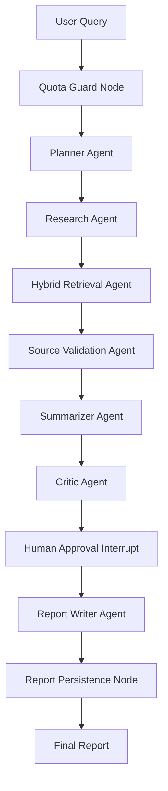

# research-agent-os

AI Research Analyst OS for reliable multi-step research workflows.

Production-grade AI research platform using LangGraph, FastAPI, Next.js, ChromaDB, and human-in-the-loop workflows to generate validated research reports with citations, token tracking, and admin analytics.

This project demonstrates how to design production-grade AI agent systems with state, human approval, hybrid retrieval, source validation, observability, quota control, and admin governance instead of relying on one-shot LLM calls.

## Product Vision

Users enter a research query such as:

> Research top trends in AI data engineering for 2026.

The platform generates a structured research report with an executive summary, key trends, supporting sources, competitor examples, risks, recommendations, citations, source quality scoring, agent reasoning summary, and token usage breakdown.

## Target Architecture

- `apps/web`: Next.js App Router frontend with TypeScript, Tailwind CSS, shadcn/ui, Recharts, React Hook Form, and Zod.
- `apps/api`: FastAPI backend with Pydantic, SQLAlchemy 2.0 or SQLModel, Alembic, PostgreSQL, Redis, LangGraph, ChromaDB, Pytest, and structured logging.
- `packages/shared`: shared constants, documentation-oriented utilities, and cross-app conventions.
- `packages/api-contracts`: shared request and response contracts as the API surface stabilizes.
- `infra`: deployment and infrastructure configuration such as Nginx.
- `scripts`: developer and seed scripts.

## Core Workflow



## 18-Day Implementation Plan

1. Monorepo foundation.
2. Next.js landing page.
3. Auth frontend.
4. FastAPI backend foundation and auth.
5. PostgreSQL models and Alembic migrations.
6. Authenticated dashboard shell.
7. LangGraph workflow skeleton.
8. Human approval flow.
9. Research run UI.
10. ChromaDB integration.
11. Hybrid retrieval with rank fusion.
12. Source validation agent.
13. Report history and detail pages.
14. Token usage tracking.
15. Admin user management.
16. Admin analytics dashboard.
17. Docker, worker, and core tests.
18. Polish, docs, and interview readiness.

## Day 1 Status

Day 1 initializes the production monorepo structure and developer experience foundation. Application code is intentionally deferred so each later day has a focused, reviewable commit.

## Day 2 Status

Day 2 adds the Next.js App Router frontend foundation and a polished SaaS-style landing page for the AI Research Analyst OS. The page includes a hero experience, product pillars, LangGraph workflow visualization, hybrid retrieval explanation, admin analytics preview, report preview, tech stack badges, and CTA buttons.

## Day 3 Status

Day 3 adds user-friendly sign-in and sign-up screens with React Hook Form, Zod validation, loading states, validation messages, success feedback, and an API client placeholder ready for the Day 4 FastAPI auth endpoints.

## Day 4 Status

Day 4 adds the FastAPI backend foundation for authentication: environment-based configuration, SQLAlchemy database session setup, a user model, password hashing, JWT session cookies, signup/signin/logout/me routes, and backend tests that run against SQLite.

## Day 5 Status

Day 5 adds the first production database layer: SQLAlchemy models for core product tables and Alembic migration setup with an initial migration for users, research runs, agent steps, token usage, reports, sources, approval requests, admin audit logs, and prompt versions.

## Day 6 Status

Day 6 adds the authenticated dashboard shell: responsive workspace navigation, account-check placeholder, dashboard metrics, quota and usage cards, current workflow preview, recent reports, recent research runs, and placeholder pages for upcoming dashboard flows.

## Day 7 Status

Day 7 adds the first LangGraph workflow skeleton for backend research runs. The API now has typed graph state, deterministic mock LLM provider hooks, quota guard, planner, research, summarizer, critic, and report writer nodes, plus agent step persistence into the existing `agent_steps` table during workflow execution.

## Getting Started

Copy the example environment file and update secrets locally:

```bash
cp .env.example .env
```

Review available developer commands:

```bash
make help
```

Validate Docker Compose configuration:

```bash
make docker-config
```

Start the local dependency stack once Docker is available:

```bash
make docker-up
```

Run the web app locally once Node dependencies are installed:

```bash
npm install
npm run dev --workspace @research-agent-os/web
```

Run the API locally after installing backend dependencies:

```bash
cd apps/api
python -m venv .venv
.venv\Scripts\activate
pip install -e ".[test]"
uvicorn app.main:app --reload --host 0.0.0.0 --port 8000
```

The backend reads `DATABASE_URL` from `.env`. The default value targets the local PostgreSQL service from Docker Compose; tests override it with SQLite.

Run database migrations once PostgreSQL is available:

```bash
cd apps/api
alembic upgrade head
```

## Local Services

Default development ports:

- Web: `http://localhost:3000`
- API: `http://localhost:8000`
- PostgreSQL: `localhost:5432`
- Redis: `localhost:6379`
- ChromaDB: `http://localhost:8001`

## Interview Talking Point

This project shows how to design reliable multi-step agent systems with state, human approval, hybrid retrieval, source validation, observability, quota control, and production-grade admin governance rather than simple one-shot LLM calls.

## Known Limitations

- The Day 3 frontend auth pages are implemented with demo submit behavior while the real backend endpoints are still pending.
- Dashboard routes now have a frontend shell with demo data and placeholders for upcoming flows.
- FastAPI auth endpoints now exist, but the frontend still uses its demo auth client until it is connected to the API.
- Alembic migrations now exist, but they have not been run against a real PostgreSQL instance in this workspace.
- LangGraph execution now exists as a backend skeleton with a mock provider; vector search, real LLM calls, human approval interrupts, and admin dashboards are planned for later days.
- Docker app services point to future Dockerfiles that will be added as the frontend, backend, and worker are implemented.
