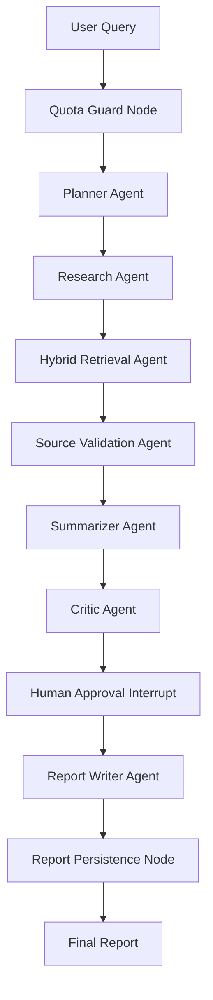

# research-agent-os

AI Research Analyst OS for reliable multi-step research workflows.

This project demonstrates how to design production-grade AI agent systems with state, human approval, hybrid retrieval, source validation, observability, quota control, and admin governance instead of relying on one-shot LLM calls.

## Product Vision

Users enter a research query such as:

> Research top trends in AI data engineering for 2026.

The platform generates a structured research report with an executive summary, key trends, supporting sources, competitor examples, risks, recommendations, citations, source quality scoring, agent reasoning summary, and token usage breakdown.

## Target Architecture

- `apps/web`: Next.js App Router frontend with TypeScript, Tailwind CSS, shadcn/ui, Recharts, React Hook Form, and Zod.
- `apps/api`: FastAPI backend with Pydantic, SQLAlchemy 2.0 or SQLModel, Alembic, PostgreSQL, Redis, LangGraph, ChromaDB, Pytest, and structured logging.
- `packages/shared`: shared constants, documentation-oriented utilities, and cross-app conventions.
- `packages/api-contracts`: shared request and response contracts as the API surface stabilizes.
- `infra`: deployment and infrastructure configuration such as Nginx.
- `scripts`: developer and seed scripts.

## Core Workflow



## 18-Day Implementation Plan

1. Monorepo foundation.
2. Next.js landing page.
3. Auth frontend.
4. FastAPI backend foundation and auth.
5. PostgreSQL models and Alembic migrations.
6. Authenticated dashboard shell.
7. LangGraph workflow skeleton.
8. Human approval flow.
9. Research run UI.
10. ChromaDB integration.
11. Hybrid retrieval with rank fusion.
12. Source validation agent.
13. Report history and detail pages.
14. Token usage tracking.
15. Admin user management.
16. Admin analytics dashboard.
17. Docker, worker, and core tests.
18. Polish, docs, and interview readiness.

## Day 1 Status

Day 1 initializes the production monorepo structure and developer experience foundation. Application code is intentionally deferred so each later day has a focused, reviewable commit.

## Getting Started

Copy the example environment file and update secrets locally:

```bash
cp .env.example .env
```

Review available developer commands:

```bash
make help
```

Validate Docker Compose configuration:

```bash
make docker-config
```

Start the local dependency stack once Docker is available:

```bash
make docker-up
```

## Local Services

Default development ports:

- Web: `http://localhost:3000`
- API: `http://localhost:8000`
- PostgreSQL: `localhost:5432`
- Redis: `localhost:6379`
- ChromaDB: `http://localhost:8001`

## Interview Talking Point

This project shows how to design reliable multi-step agent systems with state, human approval, hybrid retrieval, source validation, observability, quota control, and production-grade admin governance rather than simple one-shot LLM calls.

## Known Limitations

- Next.js and FastAPI applications are not initialized on Day 1.
- Auth, LangGraph execution, vector search, and admin dashboards are planned for later days.
- Docker app services point to future Dockerfiles that will be added as the frontend, backend, and worker are implemented.

